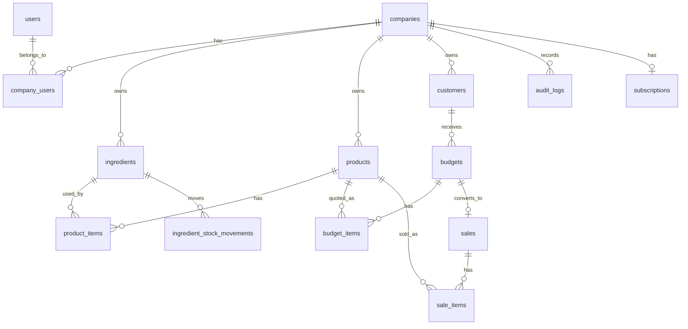

# Modelagem inicial do banco

## Entidades principais

## Tabelas

### `users`

Perfil local do usuario autenticado no Supabase Auth.

Campos principais:

- `id`: mesmo UUID de `auth.users`
- `full_name`
- `email`
- `phone`
- `avatar_url`
- `created_at`
- `updated_at`

### `companies`

Empresa/tenant do SaaS.

Campos principais:

- `id`
- `name`
- `slug`
- `document`
- `email`
- `phone`
- `created_at`
- `updated_at`

### `company_users`

Vinculo entre usuario e empresa.

Campos principais:

- `company_id`
- `user_id`
- `role`: `admin`, `employee`, `seller`
- `permissions`: JSON para permissoes finas futuras
- `status`: `active`, `invited`, `disabled`

### `ingredients`

Insumos usados nos produtos.

Campos principais:

- `company_id`
- `name`
- `category`
- `inventory_unit`
- `unit_cost`
- `stock_quantity`
- `minimum_stock`
- `is_active`

### `ingredient_stock_movements`

Historico de entradas, saidas, ajustes e baixas por venda.

Campos principais:

- `company_id`
- `ingredient_id`
- `type`
- `quantity_delta`
- `unit_cost`
- `source_type`
- `source_id`
- `notes`
- `created_by`
- `created_at`

### `products`

Produtos fabricados pela empresa.

Campos principais:

- `company_id`
- `name`
- `description`
- `sku`
- `estimated_cost`
- `suggested_price`
- `sale_price`
- `margin_percent`
- `is_active`

### `product_items`

Composicao do produto por insumo.

Campos principais:

- `product_id`
- `ingredient_id`
- `quantity`
- `unit`
- `conversion_factor_to_inventory`

Exemplo: se o insumo esta em kg e o produto usa gramas, `quantity = 500`, `unit = g` e `conversion_factor_to_inventory = 0.001`.

### `customers`

Clientes da empresa.

Campos principais:

- `company_id`
- `name`
- `phone`
- `email`
- `address`
- `notes`

### `budgets` e `budget_items`

Orcamentos profissionais enviados ao cliente.

Campos principais de `budgets`:

- `company_id`
- `customer_id`
- `number`
- `status`
- `valid_until`
- `subtotal_amount`
- `discount_amount`
- `total_amount`
- `notes`

Campos principais de `budget_items`:

- `budget_id`
- `product_id`
- `product_name`
- `quantity`
- `unit_price`
- `total_price`
- `estimated_cost`

### `sales` e `sale_items`

Vendas efetivadas, geradas manualmente ou por conversao de orcamento.

Campos principais de `sales`:

- `company_id`
- `customer_id`
- `budget_id`
- `number`
- `status`
- `subtotal_amount`
- `discount_amount`
- `total_amount`
- `estimated_profit`
- `sold_at`

### `audit_logs`

Trilha de auditoria para acoes importantes.

Campos principais:

- `company_id`
- `user_id`
- `action`
- `entity_type`
- `entity_id`
- `metadata`
- `ip_address`
- `created_at`

### `subscriptions`

Base para planos Free, Pro e Empresa.

Campos principais:

- `company_id`
- `plan`
- `status`
- `provider`
- `provider_customer_id`
- `provider_subscription_id`
- `limits`
- `current_period_end`

## Regras importantes

- Toda tabela de negocio deve ter `company_id`.
- Chaves unicas visiveis ao usuario devem ser unicas por empresa.
- Valores financeiros devem usar `numeric(14,2)` ou `numeric(14,4)`.
- Quantidades devem usar `numeric(14,4)`.
- Produto deve armazenar snapshots de custo/preco para historico.
- Orcamento e venda devem armazenar snapshot de nome e preco do produto.
- Estoque nunca deve ser alterado sem gerar movimento.

## Arquivo SQL inicial

A proposta inicial de schema esta em:

- `supabase/migrations/0001_initial_schema.sql`

